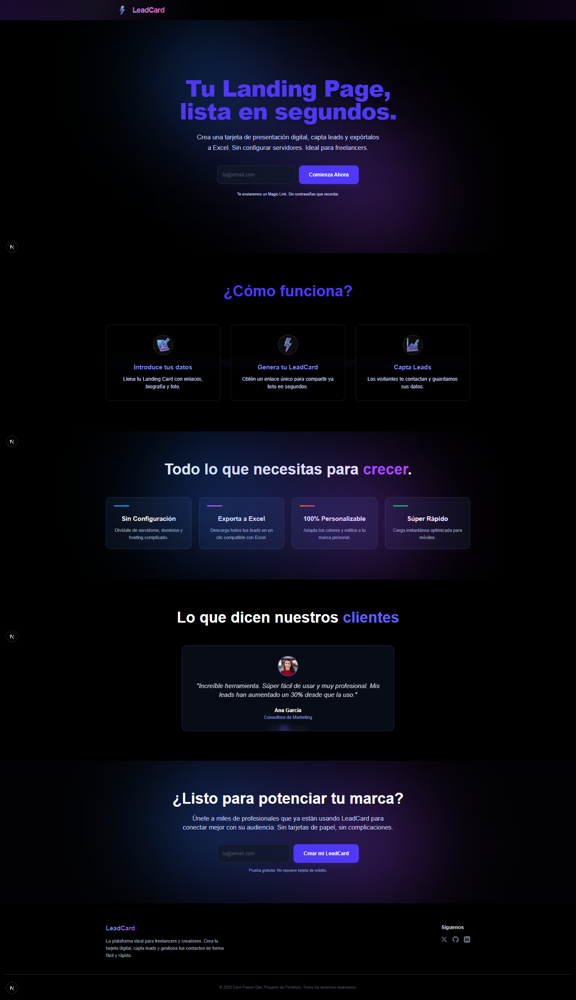
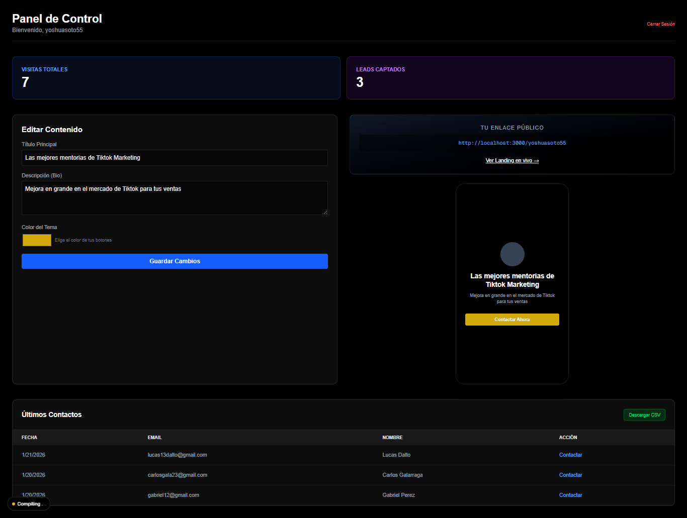
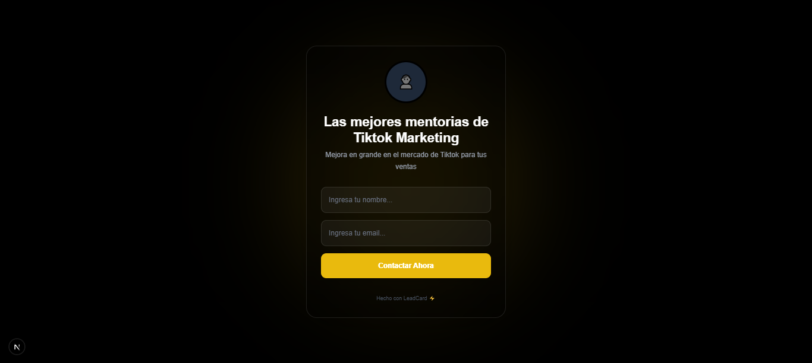

# LeadCard SaaS 🚀

**LeadCard** es una plataforma SaaS diseñada para freelancers y creadores de contenido que buscan una forma rápida, profesional y sin complicaciones de compartir su portafolio y captar leads.

Olvídate de servidores y configuraciones complejas. Crea tu tarjeta digital en segundos, comparte tu enlace único y recibe los datos de tus interesados directamente en un formato compatible con Excel.

---

## 📸 Demostración

### 1. Landing Page Principal

La puerta de entrada a la plataforma. Un diseño moderno con gradientes dinámicos y animaciones suaves para atraer a los usuarios.


### 2. Dashboard de Usuario

Donde ocurre la magia. Un panel intuitivo para gestionar tu perfil, ver tus leads capturados y descargar la información.


### 3. Tu LeadCard Pública

El resultado final. Una tarjeta digital optimizada para móviles donde tus visitantes pueden ver tu información y dejar sus datos de contacto.


---

## ✨ Características Principales

- **Sin Configuración**: No necesitas saber de servidores, dominios o hosting. Todo está listo para usar.
- **Autenticación Magic Link**: Olvídate de contraseñas. Accede de forma segura con un enlace enviado a tu correo.
- **Captación de Leads**: Formulario integrado en tu tarjeta pública para que los interesados te contacten fácilmente.
- **Exportación a Excel**: Descarga todos tus contactos con un solo clic para gestionarlos como prefieras.
- **100% Personalizable**: Adapta los colores y estilos para que coincidan con tu marca personal.
- **Súper Rápido**: Optimizado con Next.js para una carga instantánea y una experiencia de usuario fluida.

---

## 🛠️ Stack Tecnológico

Este proyecto ha sido construido con las últimas tecnologías web para garantizar rendimiento y escalabilidad:

- **Frontend**: [Next.js 15](https://nextjs.org/) (App Router) & [React 19](https://react.dev/)
- **Estilos**: [Tailwind CSS 4](https://tailwindcss.com/)
- **Base de Datos & Auth**: [Supabase](https://supabase.com/)
- **Lenguaje**: [TypeScript](https://www.typescriptlang.org/)

---

## 🚀 Cómo Empezar (Desarrollo Local)

1.  **Clonar el repositorio:**

    ```bash
    git clone https://github.com/dannfalcon33/leadcard-saas.git
    cd leadcard-saas
    ```

2.  **Instalar dependencias:**

    ```bash
    npm install
    # o
    yarn install
    ```

3.  **Configurar variables de entorno:**
    Crea un archivo `.env` en la raíz con tus credenciales de Supabase:

    ```env
    NEXT_PUBLIC_SUPABASE_URL=tu_url_supabase
    NEXT_PUBLIC_SUPABASE_ANON_KEY=tu_anon_key_supabase
    ```

4.  **Correr el servidor de desarrollo:**

    ```bash
    npm run dev
    ```

5.  Abre [http://localhost:3000](http://localhost:3000) en tu navegador.

---

## Sobre el Desarrollador 👨‍💻

**Yoshua Soto** (Dann Falcon Dev)  
_Fullstack Developer | Especialista en TypeScript_

Creador apasionado por construir aplicaciones que no solo funcionan, sino que asombran. Utilizando la potencia de la IA (Gemini) y tecnologías web modernas, me enfoco en entregar experiencias de usuario (UX) memorables e inmersivas.

📫 **Contacto**

- **Email**: yoshuasoto54@gmail.com
- **WhatsApp**: +58 0422 033 1995

##


© 2026 Dann Falcon Media. Todos los derechos reservados.
